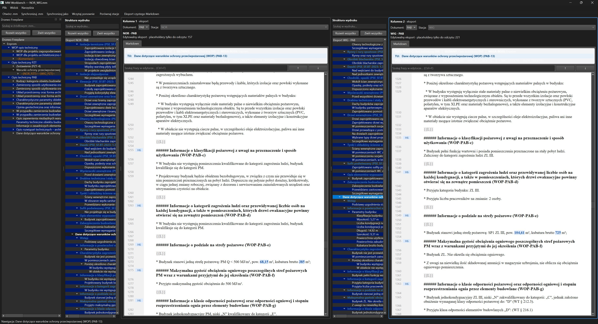
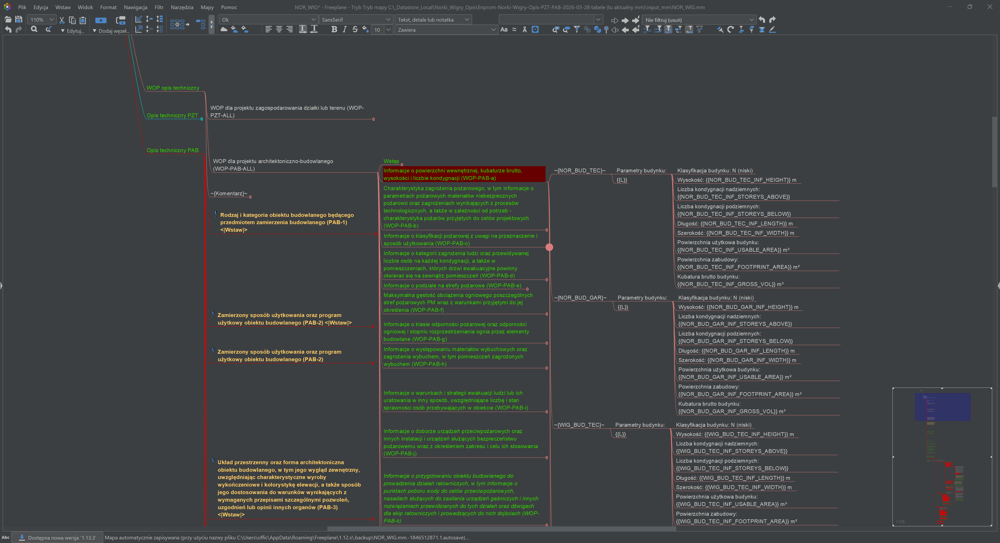

# MM Workbench

Autorskie narzędzie w Pythonie do przeglądania i analizy map myśli zapisanych w formacie Freeplane (`.mm`).

Program odczytuje dokument jako hierarchiczne drzewo XML, zachowując relacje między węzłami i ich poziomy zagnieżdżenia. Następnie przetwarza zawartość oraz wyświetla ją w czytelnej, wyrenderowanej formie zamiast surowego kodu XML.

Workbench pozwala wygodnie poruszać się po strukturze mapy i sprawdzać treść wybranego węzła wraz z jego kontekstem. Projekt pokazuje praktyczne wykorzystanie parsowania XML, struktur drzewiastych, transformacji danych i budowy interfejsu użytkownika.

Interfejs użytkownika został napisany w Pythonie z wykorzystaniem frameworka Streamlit. Elementy HTML i CSS odpowiadają za czytelną prezentację oraz formatowanie wyrenderowanej zawartości dokumentu.

Ważnym elementem pracy jest Freeplane, wykorzystywany do wizualnego projektowania i edycji drzewa. Użytkownik może budować strukturę dokumentacji w formie mapy myśli, a MM Workbench przetwarza jej plik XML i prezentuje wynik w docelowej postaci.

Workbench pozwala wygodnie poruszać się po strukturze mapy i sprawdzać treść wybranego węzła wraz z jego kontekstem. Projekt pokazuje praktyczne wykorzystanie parsowania XML, struktur drzewiastych, transformacji danych i budowy interfejsu użytkownika.
